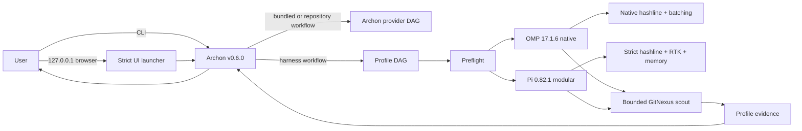

# Architecture

## Goal

Build one Archon-owned comparison harness with isolated OMP-native and Pi-modular profiles. Save context and model turns without weakening edits, search, validation, or profile attribution. Keep upstream tools replaceable and independently updatable.

## Invariants

1. `archon-harness chat` enters Archon. No direct OMP shortcut.
2. Archon runs deterministic workflow nodes. The selected profile owns its model loop and hashline implementation.
3. Every optimization assigned to a profile is enabled by default. Missing required modules fail `doctor`; no silent fallback.
4. Compression preserves exit status, decisive diagnostics, paths, code, commands, URLs, numbers, and structured data needed by the next step.
5. Code scouting returns bounded structural context. It does not dump an index or repository into model context.
6. Memory stores session knowledge, not credentials or raw environment values. Recall uses a fixed token budget.
7. External processes use argument arrays, bounded timeouts, captured logs, and explicit exit handling.
8. Upstream repositories remain untouched. Adapters depend on pinned releases or commits through small process/API contracts.
9. Tura AGPL code and GitNexus PolyForm code are not copied. Tura-style batching is an independent implementation; GitNexus runs as an external licensed tool.
10. Updates pass contract, differential, integration, and token-effect checks before lock changes merge.
11. Archon stores independent provider/model and thinking selections for each configured profile. An unconfigured profile fails before agent launch; it never inherits another runtime's provider.
12. A successful CLI run surfaces the selected agent's nonempty final response after Archon completes.
13. User-facing stdout contains only the final response; orchestration and progress streams remain in per-run logs.
14. Token-effect claims are component-specific. Uncontrolled or paid-model effects are labeled as requiring A/B evidence.
15. Slack ingress is optional, Socket Mode only, and restricted by exact user, channel, and repository allowlists.
16. The harness-managed memory daemon receives only required runtime variables and runs without an LLM provider.
17. Every harness-managed memory listener is loopback-only, and lifecycle ownership covers both the wrapper and iii engine PIDs.

## Runtime

The browser surface is Archon's own UI, not a second agent runtime. The harness launcher binds it to
`127.0.0.1` behind a narrow presentation proxy, strips ambient credentials, rejects overriding Archon
dotenv files, disables telemetry, and verifies readiness. Archon owns projects, conversations,
workflow JSON, and run state. The proxy changes only HTML presentation so workflow IDs and API payloads
remain upstream-owned. Harness workflows launch their explicit profile with unique per-run artifacts.

## Modules

| Module | Differentiator | Boundary | Failure policy |
| --- | --- | --- | --- |
| Archon | deterministic workflow, isolation, channel adapters | CLI + YAML workflow; no embedded Pi model call | hard fail |
| Tura pattern | batched commands grouped by dependency step | `command_batch` tool | hard fail per step; later steps skipped |
| OMP native | native hashline; no RTK or memory | OMP CLI and OMP extension API | hard fail |
| Pi modular | strict hashline plus modular extensions | Pi CLI and Pi extension API | hard fail |
| Concise final | neutral verdict-first response policy | system prompt loaded every run | hard fail if prompt missing |
| RTK | compact command output in `pi-modular` only | external `rtk` process inside batch executor | hard fail |
| GitNexus | AST/graph/embedding scouting | external CLI with byte budget | hard fail for required scout; actionable stale-index result |
| agentmemory | cross-session knowledge in `pi-modular` only | REST lifecycle and bounded recall | hard fail; absent from OMP profile |

## Contracts

`ProcessRunner` accepts executable, argument array, cwd, environment allowlist, stdin, timeout, and output limit. It uses Node process APIs because official Pi hosts harness extensions under Node, and returns stdout, stderr, exit code, duration, truncation state, and measured bytes.

`HarnessAdapter` exposes `name`, `doctor()`, and `smoke()`. Pinned versions live in `upstreams.lock.json`; token-effect measurements use a separate benchmark contract so operational adapters stay narrow.

`SessionMemory` exposes `start`, `observe`, `search`, and `end`. Payloads use validated DTOs. Secrets are redacted before the boundary.

`CodeScout` exposes `ensureIndex` and bounded `query`, `context`, `impact`. Model-facing output never exceeds configured bytes.

## State

- Repository: source, workflows, prompts, tests, lock metadata.
- `~/.local/share/archon-harness/`: Archon state, audits, service logs, and agentmemory persistence.
- `~/.omp/agent/config.yml`: existing OMP config, read-only; the workflow passes the extension path explicitly.
- `.gitnexus/`: per-codebase generated index, ignored by Git.
- agentmemory: upstream-owned persistence, local embeddings, synthetic compression, and no inherited provider credentials.
- Archon: upstream-owned workflow and session persistence.

## Compatibility Verification

The Bun suite checks immutable upstream metadata, adapters, Node-compatible command execution, command batching, hashline edits, both extension hosts, workflow structure, installation, redaction, Slack allowlists, quiet output, profile isolation, and fail-closed evidence. `tests/integration` runs the public chat command and both profile-specific Archon DAGs through their real harness extensions with no-model fixtures. `doctor` verifies both executable boundaries; `benchmark` measures offline component effects while refusing unsupported aggregate claims.

An upstream update is accepted only when:

- pinned identity matches;
- CLI/API contract checks pass;
- hashline fixture edits and RTK command rewriting preserve their asserted semantics;
- GitNexus finds expected symbols and limits output;
- agentmemory recalls seeded facts within budget;
- Archon executes the workflow through OMP;
- all always-on modules appear in the run audit;
- quality assertions pass before savings are reported.

## Security and Licensing

No credentials enter logs, memory, benchmark fixtures, or repository config. Slack tokens remain environment-only; the bridge does not alter workspace permissions or app configuration. GitNexus is noncommercial unless separately licensed; Bauhealth work-product use remains blocked until that license boundary is resolved.
