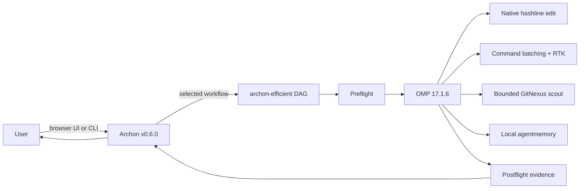

# Architecture

## Goal

Build one Archon-owned coding harness. Save context and model turns without weakening edits, search, validation, or memory. Keep upstream tools replaceable and independently updatable.

## Invariants

1. `archon-harness chat` enters Archon. No direct OMP shortcut.
2. Archon runs deterministic workflow nodes. OMP owns model loop and hashline edits.
3. Every optimization is enabled by default. Missing required modules fail `doctor`; no silent fallback.
4. Compression preserves exit status, decisive diagnostics, paths, code, commands, URLs, numbers, and structured data needed by the next step.
5. Code scouting returns bounded structural context. It does not dump an index or repository into model context.
6. Memory stores session knowledge, not credentials or raw environment values. Recall uses a fixed token budget.
7. External processes use argument arrays, bounded timeouts, captured logs, and explicit exit handling.
8. Upstream repositories remain untouched. Adapters depend on pinned releases or commits through small process/API contracts.
9. Tura AGPL code and GitNexus PolyForm code are not copied. Tura-style batching is an independent implementation; GitNexus runs as an external licensed tool.
10. Updates pass contract, differential, integration, and token-effect checks before lock changes merge.
11. Archon stores a base provider/model; OMP thinking is validated and passed independently.
12. A successful CLI run surfaces OMP's nonempty final response after Archon completes.
13. User-facing stdout contains only the final response; orchestration and progress streams remain in per-run logs.
14. Token-effect claims are component-specific. Uncontrolled or paid-model effects are labeled as requiring A/B evidence.
15. Slack ingress is optional, Socket Mode only, and restricted by exact user, channel, and repository allowlists.
16. The harness-managed memory daemon receives only required runtime variables and runs without an LLM provider.
17. Every harness-managed memory listener is loopback-only, and lifecycle ownership covers both the wrapper and iii engine PIDs.

## Runtime

The recommended browser surface is Archon's own UI, not a second agent runtime. A future harness
launcher must start it on `127.0.0.1`; projects and workflows remain Archon-owned, while every
`archon-efficient` agent node still launches the pinned OMP binary with the harness extension and
policy.

## Modules

| Module | Differentiator | Boundary | Failure policy |
| --- | --- | --- | --- |
| Archon | deterministic workflow, isolation, channel adapters | CLI + YAML workflow; no embedded Pi model call | hard fail |
| Tura pattern | batched commands grouped by dependency step | `command_batch` tool | hard fail per step; later steps skipped |
| OMP | native hashline edits | OMP CLI and extension API | hard fail |
| Caveman | terse response and prose-doc policy | system prompt loaded every run | hard fail if prompt missing |
| RTK | compact command output | external `rtk` process inside batch executor | raw fallback only when config explicitly permits |
| GitNexus | AST/graph/embedding scouting | external CLI with byte budget | hard fail for required scout; actionable stale-index result |
| agentmemory | cross-session human-readable knowledge | REST lifecycle and bounded recall | hard fail by default; no hidden memory loss |

## Contracts

`ProcessRunner` accepts executable, argument array, cwd, environment allowlist, stdin, timeout, and output limit. It returns stdout, stderr, exit code, duration, truncation state, and measured bytes.

`HarnessAdapter` exposes `name`, `doctor()`, and `smoke()`. Pinned versions live in `upstreams.lock.json`; token-effect measurements use a separate benchmark contract so operational adapters stay narrow.

`SessionMemory` exposes `start`, `observe`, `search`, and `end`. Payloads use validated DTOs. Secrets are redacted before the boundary.

`CodeScout` exposes `ensureIndex` and bounded `query`, `context`, `impact`. Model-facing output never exceeds configured bytes.

## State

- Repository: source, workflows, prompts, tests, lock metadata.
- `~/.local/share/archon-harness/`: Archon state, audits, service logs, and agentmemory persistence.
- `~/.omp/agent/config.yml`: existing OMP config, read-only; the workflow passes the extension path explicitly.
- `.gitnexus/`: per-codebase generated index, ignored by Git.
- agentmemory: upstream-owned persistence, local embeddings, synthetic compression, and no inherited provider credentials.
- Archon: upstream-owned workflow and session persistence.

## Compatibility Verification

The Bun suite checks immutable upstream metadata, adapters, command batching, hashline edits, extension loading, workflow structure, installation, redaction, Slack allowlists, quiet output, and fail-closed activation evidence. `tests/integration` runs the public chat command and installed Archon DAG through the real harness extension with a no-model fixture. `doctor` verifies installed executable boundaries, `smoke` exercises every local optimization, and `benchmark` measures offline component effects while refusing unsupported aggregate claims.

An upstream update is accepted only when:

- pinned identity matches;
- CLI/API contract checks pass;
- hashline fixture edits and RTK command rewriting preserve their asserted semantics;
- GitNexus finds expected symbols and limits output;
- agentmemory recalls seeded facts within budget;
- Archon executes the workflow through OMP;
- all always-on modules appear in the run audit;
- quality assertions pass before savings are reported.

## Security and Licensing

No credentials enter logs, memory, benchmark fixtures, or repository config. Slack tokens remain environment-only; the bridge does not alter workspace permissions or app configuration. GitNexus is noncommercial unless separately licensed; Bauhealth work-product use remains blocked until that license boundary is resolved.
